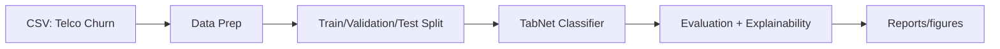

# Telco Customer Churn — TabNet (PyTorch)

A clean, portfolio‑ready repo showcasing a modern deep‑learning approach (TabNet) on the classic IBM Telco Customer Churn dataset. It includes notebooks, minimal source code scaffolding, and documentation to reproduce results and extend the project.

## Key Features
- End‑to‑end flow: data prep → feature engineering → model training & evaluation (TabNet).
- Clear, modular structure (`src/`, `notebooks/`, `data/`, `docs/`).
- Lightweight scripts with TODOs so you can make it your own.
- Data dictionary and a 100‑row sample to keep the repo lean.

## Pipeline (Mermaid)


## Project Structure
```
telco-churn-tabnet/
├─ notebooks/
│  ├─ telco_churn_tabnet_analysis.ipynb
│  └─ README.md
├─ src/
│  ├─ __init__.py
│  ├─ data_prep.py
│  └─ model_tabnet.py
├─ scripts/
│  └─ prepare_data.py
├─ data/
│  ├─ README.md
│  └─ sample/
│     └─ sample_100.csv
├─ docs/
│  └─ data_dictionary.md
├─ reports/
│  └─ figures/
│     └─ .gitkeep
├─ models/ (git-ignored)
├─ logs/   (git-ignored)
├─ requirements.txt
├─ .gitignore
├─ LICENSE
├─ CITATION.cff
└─ README.md
```

## Quickstart

1. **Create & activate a virtual environment** (conda or venv).
2. **Install PyTorch first** for your OS/accelerator from https://pytorch.org/.
3. Install the rest:
   ```bash
   pip install -r requirements.txt
   ```
4. Start Jupyter:
   ```bash
   jupyter lab
   ```
5. Open the notebooks in `notebooks/` and run them.

### Data
- Local path expected for full dataset: `data/raw/WA_Fn-UseC_-Telco-Customer-Churn.csv` (git‑ignored).
- This repo ships a tiny sample at `data/sample/sample_100.csv` to keep things light.
- **License note:** verify the dataset’s license from your original source before committing the full CSV to a public repo.

### Reproduce (CLI option)
```bash
# Create train/val/test splits (optional)
python -m src.data_prep --input data/raw/WA_Fn-UseC_-Telco-Customer-Churn.csv --outdir data/processed

# (Scaffold) Train TabNet once you add your details
python -m src.model_tabnet --train data/processed/train.csv --val data/processed/val.csv --target Churn
```

## Results

- **Accuracy (TabNet, test set):** `0.78`
- **ROC AUC (TabNet, test set):** `0.8177`  _(exact from notebook: 0.8177314400194644)_
- **Confusion matrix (TN, FP / FN, TP):**
  ```
  [[945, 88],
   [216, 158]]
  ```
- **Feature importance (TabNet masks, top signals):**  
  `Contract_Month-to-month, OnlineBackup_No, tenure, MonthlyCharges, OnlineSecurity_No, TotalCharges, PaperlessBilling, PaymentMethod_Electronic check`

> **Context from the notebook:** Logistic Regression achieved the highest ROC AUC (`~0.8356`) in a baseline comparison, while TabNet provided strong performance with built‑in interpretability via attention masks.

## What I Learned

- **Why TabNet for tabular data (vs. tree‑based methods):**  
  TabNet uses **sequential attention** with **sparse feature masks** (“decision steps”) so each step focuses on the most relevant columns. Compared with Random Forest/XGBoost (ensembles of decision trees), TabNet provides **built‑in interpretability** (mask importances) and can perform well with **less hand‑crafted feature engineering**.

- **Handling messy columns & class imbalance:**  
  `TotalCharges` arrives as text with blanks; I coerced it to numeric with `errors='coerce'` and handled missing values before modeling. I dropped the identifier `customerID` and one‑hot encoded categoricals. Because churn is **imbalanced** (~26.5%), I evaluated with **ROC AUC** (not just accuracy) and noted how threshold tuning would adjust precision/recall trade‑offs.

- **Turning exploratory notebooks into reusable modules:**  
  I moved reusable steps into `src/` (`data_prep.py` for cleaning/splitting; `model_tabnet.py` as a training scaffold) and added a small runner in `scripts/`. Heavy/raw data is **git‑ignored**, and a **100‑row sample** enables quick iteration. Documentation (README, **data dictionary**), **MIT License**, and **CITATION.cff** make the project portfolio‑ready and reproducible.
